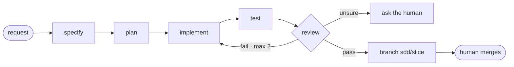

# Throughline

*An unbroken line from spec to reviewed code: every change cites the rule it follows, the test that proves it, and the reason it exists.*

You describe a change. Throughline turns it into a tested, independently reviewed feature on a branch that only you can merge, using the AI coding tool you already have (GitHub Copilot, Claude Code, or Codex). Your code stays where it is; the framework holds the process, your standards, and the shared memory. It works on any codebase, in any language.

```bash
/dev:target register path/to/my-app
/dev:feature my-app "Add cursor pagination to the orders endpoint"
# spec -> plan -> tasks -> implement -> tests -> review -> branch sdd/<slice>.   You do the merge.
```

> **v0.1, experimental.** [STATUS.md](STATUS.md) is an account of what's actually enforced versus only instructed, and what hasn't been tested yet. Read it before you rely on this for real work.
>
> Ask for auth, payments, or personal-data work and Throughline marks it CRITICAL. From there you lead and the agents only assist. That limit is deliberate.

## What it is

Throughline is a spec-driven, multi-agent layer that sits on top of [spec-kit](https://github.com/github/spec-kit) and drives your AI coding tool. You describe a change; a team of eight single-purpose agents specs it, plans it, writes it on a branch, tests it, and an independent reviewer checks it against your standards before anyone calls it done. Nothing merges without you. The process and the knowledge live in this repo. Your product code never does.

## What it's good for (and what it's not)

Reach for it on a change you'd want a careful teammate to review. You name a registered project (say `orders-api`) and describe the change in plain words; here's what you get back:

- **Ship a feature, safely.**
  `/dev:feature orders-api "add cursor pagination to GET /orders"`
  → it specs the change, writes it on a branch, adds tests, and an independent reviewer signs off against your standards before *you* merge.
- **Fix a bug, with proof it's fixed.**
  `/dev:feature orders-api "GET /orders returns the wrong page when ?page is negative" --micro`
  → a test that fails before the fix and passes after, plus a one-line record of why it changed — not just a patch. (That's the exact shape of the real [pytest bug](docs/validation-runs/2026-06-16-swebench-pytest-11143.md) it fixed end to end.)
- **Get your bearings before touching unfamiliar code.**
  `/dev:analyze orders-api src/billing`
  → a grounded map of the modules and the conventions they actually follow, so your change starts from how the code really works.
- **Get a second opinion on a change someone already made.**
  `/dev:review orders-pagination` (the change's slice)
  → the reviewer re-reads your standards from source and returns PASS / CONDITIONAL_PASS / FAIL with cited reasons.

**Skip it** when there's nothing to review or record — a throwaway script, a one-line tweak, or a plain question like *"what does this function do?"*. Those go to your AI tool's normal chat. The rule of thumb: **a change goes through Throughline; a question goes to plain chat.**

The full set, with examples, is in [What to use Throughline for](docs/use-cases.md).

## Why it exists

Frontier models are great at the happy path and bad at the boring parts: forgotten input validation, the edge cases, the error handling. These are *specification-completeness* bugs, and asking the model for "more" or "thorough" tests doesn't fix them. It just writes more happy-path tests.

What does work is grounding. Tie each test to a rule in an enumerated spec, then let an independent reviewer check the result against the source standards. We measured this in a controlled study of LLM code generation:

- It produced correct code **38 points** more often than a strong baseline that was already told to probe edges and invalid inputs. The lever was the grounding, not the number of tests; doubling the test budget barely helped.
- The effect held on three different model families: Claude (+38), GPT-5.3-codex (+28), and Gemini (+19). It never reversed.
- Grounding also cut false alarms. The grounded tester wrongly rejected correct code 0% of the time, against 33% for ungrounded "test the edges" prompting.
- A weaker model with this discipline beat a stronger model without it.

One honest boundary: on clean, well-specified algorithmic problems, where models rarely slip in the first place, grounding neither helps nor hurts. The gain shows up on the spec-completeness bugs that dominate real one-shot failures. Throughline puts that discipline on rails: the Tester writes tests from your spec's rules, and an independent Reviewer checks the fix against the standards' source text.

## How it works



Eight agents, each with one job, handing off through files rather than reaching into each other's work: Orchestrator, Analyst, Architect, Implementer, Tester, Reviewer, Archivist, Auditor.

The review step is the heart of it. The Reviewer reads your standards from source (not the implementer's summary of them) and returns PASS, CONDITIONAL_PASS, or FAIL on a confidence score. It's the same kind of model on both sides, so treat it as a strong check rather than a second human. Your merge is the real final check.

A few things hold this together. Every change cites the spec requirement it satisfies, the standard clause it follows, and an example when one exists, so it's cite-or-don't-ship. Each change is a *slice* (one feature, fix, or refactor), and all of its edits land on a dedicated git branch named `sdd/<slice>` — e.g. `sdd/orders-pagination` (`sdd` = spec-driven development) — created **in your target project's own repo**, not in the framework. Nothing touches your main branch until you merge; to undo, just delete the branch. (A target with no git repo is handled too: originals are backed up under `work-queue/backups/<slice>/` instead.) Agents never merge or push, and `/standards/` is read-only at the hook level. And the knowledge compounds: your standards, examples, and past decisions live in a shared wiki that every later task draws on.

### Does the review actually catch real bugs?

We built the same three tasks two ways, plain (one quick pass) and through Throughline, with the same model both times. Each plain version passed its own tests and looked finished. The review step found a real bug in all three:

| Task | Plain version (tests passed) | What the review caught |
|------|------------------------------|------------------------|
| Compare versions | exit 0 | `1.0.0-rc.1` treated as **newer** than `1.0.0` (plus 3 more) |
| Split money | exit 0 | `$10 ÷ 3` gives parts that add up to **$9.99**, not $10 |
| Pagination | exit 0 | `page = -1` quietly returns the **wrong rows**, no error |

These tasks had tricky edges on purpose, which is exactly where the check earns its keep; on a simple task done right it finds nothing. [Full run.](docs/validation-runs/2026-06-13-ab-suite.md)

Throughline has also solved a real **SWE-bench Lite** issue end to end (in `pytest-dev/pytest`), working from the bug report alone. Its one-line root-cause fix passes the benchmark's own hidden test with no regressions (115 tests still green), and the Tester broadened the coverage past the single case in the gold test. [Full run.](docs/validation-runs/2026-06-16-swebench-pytest-11143.md)

## Requirements

Close to nothing. Throughline is mostly markdown the model reads; the engine is the AI tool you already have.

- **git** — for the reversible per-change branches (`sdd/<slice>`, [explained above](#how-it-works)) and to read your target's state.
- **One AI coding tool** — GitHub Copilot in VS Code, Claude Code, or Codex. That's the engine.
- That's it. spec-kit isn't a separate install (its commands and its bash + PowerShell helper scripts ship inside `.specify/`), and the write-safety hooks need no extra runtime — they run on PowerShell on Windows and bash on macOS/Linux, with a plain-shell fallback so **Python is not required** (there's an optional Python path if you prefer it). The VS Code dashboard is optional and ships as a prebuilt `.vsix`, so it needs no Node build.

So on any of the three tools, on Windows/macOS/Linux: clone, run the one-time `tools/setup-hooks.*` to wire the hooks for your OS, and go.

## Getting started

### Pick your tool

Throughline is the same framework behind three thin adapters. Use whichever tool you already have; the commands are identical and only the slash punctuation changes. **These docs default to the Claude Code colon form** (`/dev:feature`); Copilot and Codex use a dot (`/dev.feature`).

| Tool | Slash syntax | Status | Guide |
|------|--------------|--------|-------|
| Claude Code | `/dev:feature` | Supported | [docs/runtimes/claude-code.md](docs/runtimes/claude-code.md) |
| GitHub Copilot (VS Code) | `/dev.feature` | Supported | [docs/runtimes/copilot.md](docs/runtimes/copilot.md) |
| Codex | `/dev.feature` | Preview | [docs/runtimes/codex.md](docs/runtimes/codex.md) |

Start here for the overview and a comparison: [docs/runtimes/](docs/runtimes/).

### First run

```bash
git clone <repo-url> && cd throughline
powershell -ExecutionPolicy Bypass -File tools\setup-hooks.ps1   # Windows   ┐ one-time: wire the
bash tools/setup-hooks.sh                                        # mac/Linux ┘ write-safety hooks
# open in VS Code (Copilot), or run `claude` (Claude Code), or `codex` (Codex)
/speckit:constitution && /dev:ingest-standards && /dev:ingest-exemplars   # one-time: load the rules
/dev:target register path/to/my-app                                       # point at your code
/dev:feature my-app "Add cursor pagination to the orders endpoint"        # build it
```

### Ways to use it

1. Think first: `/dev:ideate "<rough idea>"` explores options and trade-offs before any spec (read-only; builds nothing).
2. One command for the whole lifecycle: `/dev:feature` runs specify through review.
3. Cheaper modes: `--micro` (implement, test, review) or `--express` (skip the optional approval pauses).
4. Phase by phase, if you want the control: `/speckit:specify`, `clarify`, `plan`, `tasks`, `implement`.
5. Single commands, out of band: `/dev:ideate`, `/dev:analyze`, `/dev:test`, `/dev:review`, `/dev:audit`.
6. Knowledge only: ingest your standards and examples and use the skills ad hoc.

Each one is spelled out in your tool's exact syntax in the [runtime guides](docs/runtimes/). Every slice also leaves a human-readable entry in `<target>/.throughline/CHANGELOG.md`, so each codebase carries its own record of what changed and why.

## For teams

A better model makes each agent better. It doesn't fix consistency, audit trails, or trust across a team. That's the part Throughline is for. It turns one request into a change that is reviewed, recorded, and easy to undo:

| The problem | What helps |
|-------------|------------|
| Agents write code differently every time | Your rules, plus an independent review step |
| No record of why something changed | Each change links spec to task to rule to result, and it's all saved |
| Agents could break things | Hooks block risky writes and merges; only people merge |
| Lessons get forgotten | A shared wiki keeps the rules, examples, and decisions |

Does it save tokens? Per task, no, because it runs more steps. Over time it tends to pay for itself the way insurance does: a little extra on every task, returned on the ones where it catches a bug that would have been expensive to find later. It's worth it for code that matters, and overkill for throwaway changes, where `--micro` or plain Copilot is the better call.

## Layout

| Folder | What's inside |
|--------|---------------|
| `.specify/` | The engine: constitution, command runbooks, templates, workflows |
| `.github/` · `.claude/` · `.codex/` | The Copilot, Claude Code, and Codex adapters, plus hooks (CI lives in `.github/`) |
| `standards/` · `exemplars/` | Your rules and example code, the read-only inputs you write |
| `wiki/` | What the agents remember, plus an append-only log of everything they do |
| `specs/` · `work-queue/` · `review-reports/` | Per-task files and status |
| `targets/` | The list of outside projects the agents work on |
| `tools/dashboard/` | A VS Code extension with a live view of the work queue |
| `docs/` | The user guide, including the per-tool runtime guides |

## More

[User guide](docs/README.md) · [Runtime guides](docs/runtimes/) · [Commands](COMMANDS.md) · [Architecture](ARCHITECTURE.md) · [Status](STATUS.md) · [Contributing](CONTRIBUTING.md) · [Constitution](.specify/memory/constitution.md)

MIT, see [LICENSE](LICENSE). The standards and examples that ship are starter seeds; swap in your own.
